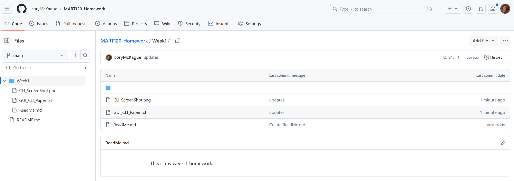

# Week 1 Homework

## Github
1. Create a GitHub.com account.
2. Create a MART-120 (or something equivalent) repository at GitHub.com.
3. Download and connect GitHub Desktop to your MART-120 repository.
4. Pull your online repository to your local computer.
5. Create a folder called Homework 1 in your local repository (i.e. the one on your computer).
6. Write a short paper comparing the GUI (graphical user interface) and the CLI (command-line interface) around 200 words.
7. Place your GUI/CLI paper into the Homework 1 folder on your computer.
9. Add a screenshot of your CLI to your Homework 1 folder on your computer.
10. Push your local repository to your online repository using GitHub Desktop.
11. Submit your GitHub repository link to Moodle.
12. There should be two items in the Homework 1 folder of your MART-120 repository.

Example:

## Specifics for Moodle

1. Turn in a link to your repository
2. Submit your introduction on <a href="https://discord.com/channels/1193953766668501058/1194469185728811079">Discord week 1</a>