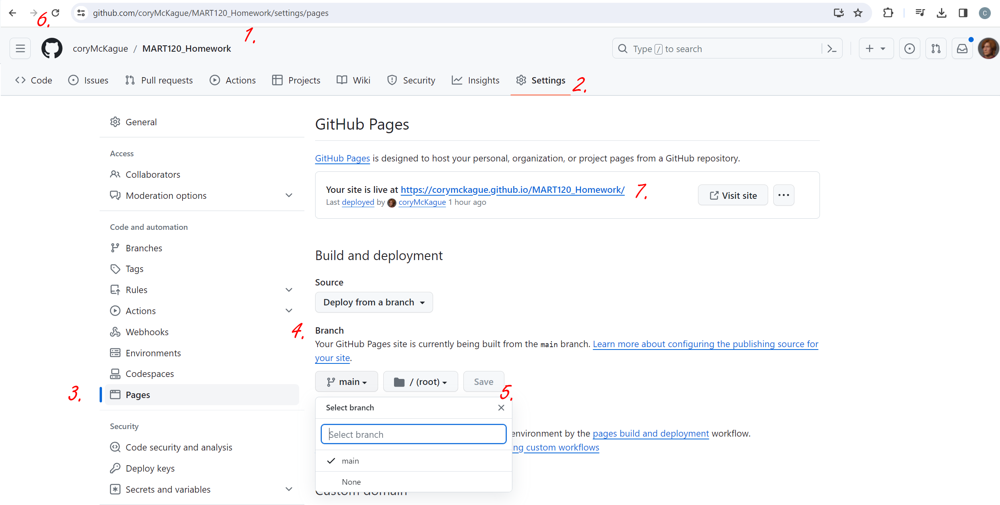
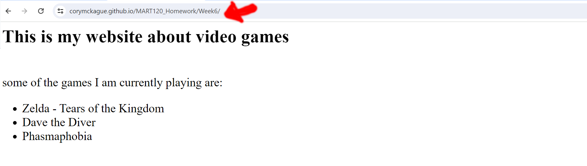

# Make your page live
<!-- video -->

<iframe src="https://umontana.hosted.panopto.com/Panopto/Pages/Embed.aspx?id=98ff25cb-679d-4467-8a9f-b11401451fba&autoplay=false&offerviewer=true&showtitle=false&showbrand=false&captions=false&interactivity=none" height="405" width="720" style="border: 1px solid #464646;" allowfullscreen allow="autoplay" aria-label="Panopto Embedded Video Player"></iframe>

No, let us make our page live!

1. Go to your online github MART 120 Homework repository
2. Go to settings at the top
3. Go to pages on your left 
4. under branch - change it from none to main. 
5. press save
6. wait a few minutes and refresh your browser
7. Press your live link

8. add your Week6 folder to your url

Next up, we are going to take a look at HTML forms.  What are those?  I bet you have used these a lot!